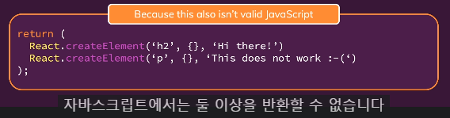
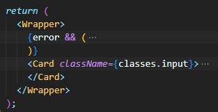
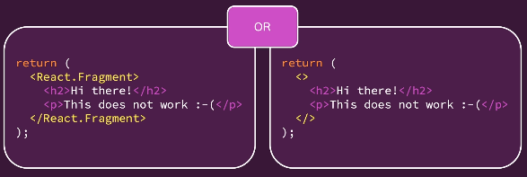

> 2022-12-26


<br>

# React 동작 원리

리액트의 주요 파일 : index.js, index.html, App.js

- index.js에서 root 요소를 생성하여 index.html에서 보여줄 페이지를 구성
- index.html : 리액트가 SPA 개발에 사용되는 이유는 index.html 문서 하나로 모든 웹 페이지를 표현할 수 있기 때문
- App.js : 모든 컴포넌트를 담는 그릇, 리액트의 컴포넌트 트리는 App 컴포넌트로부터 시작

<br>

# Props를 통한 컴포넌트 간 데이터 전달

- props는 properties를 의미하며 보통 props라는 이름으로 사용
- props는 상위 컴포넌트로부터 전달된 properties들을 담는 객체
- 하위 컴포넌트에서 속성값을 얻고자 할 때 "props.속성명"으로 사용

<br>

---

> 2022-12-28

<br>

# 컴포넌트

리액트는 다양한 컴포넌트(함수)가 반환하는 요소를 렌더링 하는 원리를 이용한 컴포넌트들의 결합을 통해 사용자 인터페이스를 구현하는 라이브러리이다.

컴포넌트들로 구성된 페이지를 크롬의 개발자 도구에서 확인하면 사용자 정의 컴포넌트의 모습은 확인할 수 없다. 그 이유는 결국 사용자 정의 컴포넌트도 기본 컴포넌트로 구성되기 때문이다.

<br>

---

> 2023-01-01


<br>

# 이벤트 리스너

리액트는 우리가 설정한 속성(onClick)에 설정한 값(clickHandler)을 렌더링된 요소에 리스너로 추가한다.

렌더링된 요소는 결국 자식 컴포넌트이며, 부모 컴포넌트(함수를 정의하고 컴포넌트를 사용한 코드를 가진 컴포넌트)로부터 props로 함수를 전달받아 실행할 수 있다.
자식 컴포넌트는 함수 실행 결과를 부모 컴포넌트에게 전달할 수 있다.

```
function func_name(props) {

    const clickHandler = () => {
        console.log("Clicked!");
    }

    return (
        <button onClick={clickHandler}>
            Change Title
        </button>
    );
}
```

## 이벤트 리스너 추가 방법

1. 이벤트 리스너 함수를 작성한다.
2. 이벤트에 대한 props에서 함수를 호출하지 않고 함수 이름만 지정한다.

> 만약 함수를 호출(함수이름 + "`()`")한다면 jsx 코드가 컴파일 될 때(렌더링인가...) 함수가 실행되기 때문에 이벤트가 발생했을 때에는 반응이 없을 것이다.

<br>

## 이벤트 리스너 함수명

> 이벤트 종류 + ... + Handler

필수는 아니고 이렇게 하면 좋다~ (권장)

<br>

# State

## 리액트가 jsx를 브라우저에 보여주는 방법

1. 리액트는 함수형 프로그래밍 방식이다.
2. 함수는 jsx 코드를 반환한다.
3. 함수 호출 방법은 무엇이고, 누가 호출하지?

리액트는 jsx 코드를 보고 우리가 정의한 함수(컴포넌트 함수)를 호출한다. 가장 첫 컴포넌트는 index.js에 있다. 더이상 호출할 함수가 없을 때까지 계속해서 컴포넌트 함수를 호출한다. 이후 결과를 DOM 명령어로 변환하여 렌더링한다.

근데 리액트는 모든 DOM 요소를 렌더링한 후 작업을 멈추기 때문에 컴포넌트가 보여주는 내용을 변경하기 위해서는 state의 도입이 필요하다.
(리액트는 변수값이 바뀐다 해도 컴포넌트를 재렌더링 하지 않음)

<br>

## useState

특별한 변수를 생성하는 함수이다.
이 변수는 변경되면 컴포넌트 함수를 재실행하게 만든다.
초기값을 설정할 수 있으며, useState가 반환하는 값을 통해 변수에 접근 가능하다.

- useState 반환값 : 배열 `[초기값, 업데이트 함수]`
  - 초기값 : 말 그대로 제일 처음 저장되는 초기 상태값이다.
  - 업데이트 함수 : 상태를 변경하기 위해 사용하는 함수이다.

<br>

### 왜 state를 직접 변경하지 않고 업데이트 함수를 사용해야 하나요?

state는 리액트가 관리하는 변수 저장 공간이라 할 수 있다.
리액트는 이 state에 저장된 값이 변하면 해당 state가 존재하는 컴포넌트를 리렌더링한다.

state를 업데이트하는 함수를 호출하여 값을 변경할 수 있는데 변경된 값이 바로 반영되지 않는다. state 변경이 많으면 그만큼 리렌더링 횟수가 많아지기 때문에 성능이 저하된다. 그래서 리액트는 16ms 동안 변경되는 state 값을 저장했다가 한번에 리렌더링하는 batch update(일괄 리렌더링)를 한다.

<br>

## 독립적인 state 선언

```
const [enteredTitle, setEnteredTitle] = useState("");
const [enteredAmount, setEnteredAmount] = useState();
const [enteredDate, setEnteredDate] = useState("");

setEnteredTitle("Hello");
...
```

<br>

## state 그룹

```
const [userInput, setUserInput] = useState({
    enteredTitle: '',
    enteredAmount: '',
    enteredDate: ''
});

setUserInput({
    ...userInput,
    enteredTitle: e.target.value
});
...
```

하나의 상태 업데이트 함수에 의존하여 상태를 변경하기 때문에 이전 상태의 스냅샷에 의존하게 된다.

<br>

```
setUserInput((prevState) => {
    return { ...prevState, enteredTitle: event.target.value };
});
```

위의 방법을 사용하면 항상 최신의 이전 상태 스냅샷을 보장한다.
상태 업데이트에 의한 리렌더링 즉, 이전 상태에 의존하고 있는 컴포넌트의 경우 위의 방법을 사용해야 한다.

<br>

---

> 2023-01-01

<br>

# 데이터 전달

하향식 데이터 전달 : 부모 컴포넌트 → 자식 컴포넌트 = `props`
상향식 데이터 전달 : 자식 컴포넌트 → 부모 컴포넌트 = 함수 값 반환

부모 컴포넌트를 통해 연결된 형제 컴포넌트 간 직접적인 데이터 전달은 불가능 ▶ 가장 가까운 부모 컴포넌트를 통해 데이터 전달

<br>

## 리액트에서 이벤트리스너가 동작하지 않는 이유

addEventListener를 통한 이벤트 수신 코드는 명령형 코드이기에 해당 코드로는 React 기능을 사용하지 않으며 React 컴포넌트 외부에 있는 일부 함수를 트리거하므로 React 컴포넌트 상태와 상호 작용할 수 없습니다.

## Stateful Component vs Stateless Component

<br>

# 렌더링 리스트 및 조건부 Content

## 목록을 동적으로 렌더링 하는 방법

`map()` : JS 내장 함수. 원본 배열의 모든 요소에 대해 연산, 변환하여 새로운 배열로 반환하는 함수이다.

```
...
   {props.items.map(expense => {
        return
            <ExpenseItem
                title={expense.title}
                amount={expense.amount}
                date={expense.date}
            />
        })
   }
```

## keys


리액트는 `keys`를 통해 list를 통한 컴포넌트 인스턴스를 렌더링할 때 발생할 수 있는 성능 저하나 버그 없이 목록 업데이트와 렌더링 할 수 있다.

리액트는 새로운 list 아이템을 동적으로 추가하면 부모 컴포넌트의 마지막 자식 컴포넌트로 렌더링하고, 모든 list 아이템을 업데이트하여 DOM 요소를 교체한다.
다시 말하자면 리액트는 list 내의 아이템을 식별할 수 없기 때문에 추가된 아이템이 어디에 렌더링되어야 하는지 알지 못한다.
따라서 새로운 아이템이 어디에 추가되어야 하는지 리액트에게 알려주어야 하는데 그 방법이 바로 `key props`이다.

<br>

---

> 2023-01-03

<br>

## 조건에 따라 출력하기

### 삼항 연산자

```
{filteredExpenses.length === 0 ? (
    <p>No expenses found.</p>
    ) : (
    filteredExpenses.map(expense =>
        <ExpenseItem
            key={expense.id}
            title={expense.title}
            amount={expense.amount}
            date={expense.date}
        />
    ))
}
```

<br>

### && 연산자

```
{filteredExpenses.length === 0 && <p>No expenses found.</p>}
{filteredExpenses.length === 0 &&
    filteredExpenses.map(expense =>
        <ExpenseItem
            key={expense.id}
            title={expense.title}
            amount={expense.amount}
            date={expense.date}
        />
    )
}
```

<br>

### js 코드

```
let expensesContent = <p>No expenses found.</p>;
if (filteredExpenses.length> 0) {
    expensesContent = filteredExpenses.map(expense =>
        <ExpenseItem
            key={expense.id}
            title={expense.title}
            amount={expense.amount}
            date={expense.date}
        />
    );
}

return (
    {expensesContent}
);
```

<br><br>

> 2023-01-04

<br>

# 컴포넌트 스타일

- Conditional & Dynamic Styles
- Styled Components
- CSS Modules

<br>

## Conditional & Dynamic Styles

### 동적 인라인 스타일 설정

```
<label style={{color: isValid ? 'black' : 'red'}}>Label</label>
```

상태 변화를 통해 스타일이 동적으로 변경됨

<br>

### 동적 css 클래스 설정

```
<!-- JSX 코드 -->
<div className={`form-control ${isValid ? "" : "invalid"}`}>
  <label>Label</label>
  <input
    type="text"
  />
</div>

<!-- CSS 코드 -->
.form-control.invalid input {
  border-color: red;
  background-color: #ffd7d7;
}

.form-control.invalid label {
  color: red;
}
```

CSS 파일에 스타일이 지정된 선택자 (클래스, ID 등)의 중복으로 인해 의도하지 않은 스타일이 반영될 가능성이 있다.

이를 위해 styled component를 사용한다.

<br><br>

> 2023-01-06

<br>

## Styled Components

특정한 스타일이 첨부된 컴포넌트를 구축할 수 있도록 해주는 패키지
스타일이 첨부되는 컴포넌트에만 영향을 미치고 다른 컴포넌트에는 영향을 주지 않는다.

- 패키지 설치

```
npm install --save styled-components
```

<br>

### 사용 방법

- tagged template literal : 자바스크립트 기능

▶ button은 styled의 메소드 일종으로 괄호 대신 백틱을 사용

- button 메소드는 새로운 button 컴포넌트를 반환 (styled는 html 요소에 대한 메소드를 내장하고 있음)

<br>

- `.button:focus` 가상 선택자의 경우에는 `&` 기호를 사용하여 표현

- styled의 메소드를 통해 반환된 새 컴포넌트는 styled가 할당한 고유 클래스 명을 가지기 때문에 다른 컴포넌트에 영향을 주지 않는다!

- styled가 반환한 컴포넌트 역시 props를 전달하고, 전달받을 수 있기 때문에 유효성 검사를 통해 클래스를 추가하거나 삭제할 수 있다.

- styled 메소드 내에서 props를 사용할 수 있기 때문에 동적인 스타일링이 쉽게 가능하다.

```
<!-- JSX -->
<FormControl invalid={!isValid}>
...
</FormControl>


<!-- styled method -->
  border: 1px solid  ${props => props.invalid ? 'red' : '#ccc'};
  background-color: ${props => props.invalid ? '#ffd7d7' : 'transparent'};
```

<br><br>

> 2023-01-07

<br>

## CSS Moudules

> CSS 모듈은 그 기능을 지원하도록 설정된 프로젝트에서만 사용 가능
> <br>
> ▶ 브라우저에서 코드가 실행되기 전에 코드 변환이 필요하기 때문 (리액트 프로젝트에서 사용 가능)

<br>

CSS 모듈이 하는 일 또는 개념 또는 내부에서 수행하는 구축 프로세스는 CSS 파일이나 클래스를 가지고 그 클래스 이름을 고유하게 바꾸는 작업을 한다.

<br>

CSS 모듈의 개념은 CSS 파일에서 설정한 CSS 스타일의 범위는 해당 CSS 파일을 import한 파일 내에 있는 컴포넌트에만 적용된다는 것이다. (styles 객체를 통해 클래스에 접근하기 때문에 같은 파일의 컴포넌트에만 제한되는 것!)

<br>

### 사용 방법

```
import styles from './Button.module.css';
```

CSS 모듈을 사용하기 위해서는 css 파일을 통해 import 해야 한다.
CSS 모듈을 변환하기 위해서는 특수한 css 파일명을 사용한다.

- CSS 모듈 작동을 위해 컴파일 프로세스에게 요청

css 파일을 통해 import 한 styles 객체를 통해 css 파일에서 사용한 모든 클래스를 동적으로 사용할 수 있다.

CSS 모듈을 통해 스타일이 적용된 요소에는 styled-component와는 또다른 클래스가 추가된 것을 확인할 수 있다.


`컴포넌트 이름_클래스 이름__고유한 해시값`

<br><br>

> 2023-01-07

<br>

# Debugging React App

> 에러를 해결하는 것도 개발이다!

## Error 1


- 에러가 발생한 위치 : App.js 43번째 줄
- 에러가 발생한 원인 : JSX 함수는 하나의 루트 요소만 포함하는 컴포넌트를 반환하기 때문에 여러 개의 컴포넌트를 하나의 루트 컴포넌트로 감싸야 한다!

<br>

### 에러 코드


<br>

### 해결


<br>

## Error 2


- 에러가 발생한 이유 : addGoalsHandler 가 정의되어 있지 않아서 발생한 에러 ▶ 단순 오타로 인한 컴파일 에러!

<br>

### 에러 코드


<br>

### 해결


<br>

## Error 3


- 에러 : 삭제하려는 List item을 누르면 이전 item이 삭제됨
- 에러가 발생한 이유 : List item을 삭제하기 위해 item의 ID 값을 얻어야 한다.
  <br>그러나 ID 할당 과정에서 random() 함수를 이용한 ID가 아닌 'goal1'이라는 고정 ID가 할당되기 때문에 goal1이라는 ID를 가진 첫 번째 item이 삭제된다!

<br>

### 에러 코드


<br>

### 해결


<br><br>

# 에러 해결 방법

- Terminal에 출력되는 에러 확인
- 브라우저 창에 출력되는 에러 확인
- F12(개발자 도구)의 콘솔 탭에 출력되는 에러 또는 경고 확인
- F12의 소스 탭에서 디버깅을 통해 해결

- `react devtools` : 리액트 프로그래밍에 특화된 개발자 도구

<br><br>

> 2023-01-08

<br>

# JSX Limitations

## JSX 요소들이 인접해 있는 경우 에러 발생

▶ JSX에서는 하나의 루트 요소만 존재해야 함, 루트 수준에서 여러 JSX를 반환할 수 없음

<br>


- JSX 코드는 결국 JS의 react.createElement로 변환됨
- 실제로 자바스크립트에서 함수값을 반환할 때에도 하나의 값만을 반환할 수 있음

<br>

## Div Soup

실제 DOM으로 렌더링될 때 많은 컴포넌트들이 중첩될 수 있기 때문에 div 등의 요소로 감싸주어야 한다.
이러한 이유로 최종적으로 브라우저에서 보는 결과에 필요없는 div 태그가 매우 많아질 수 있다. jsx를 사용하기 위해서는 필요한 div이지만 semantic하지 못한 코드가 많아지게 된다.

<br>

## 해결 방법 : Wrapper

JSX의 규칙(하나의 루트 요소만 반환)을 만족하기 위한 wrap 요소로, div로 감쌀 필요 없이 wrapper로 감싸면 브라우저에 쓸모없는 코드가 나타나지 않음!

<br>

### Wrapper.js

```
const Wrapper = props => {
  return props.children;
}

export default Wrapper;
```

<br>

### 결과 코드



<br><br>

# Fragments

우리는 Wrapper 컴포넌트를 직접 만들지 않아도 된다. <strong>왜냐하면 리액트에서 제공해주니까!!!</strong>

<br>

## React fragment



`<Fragment></Fragment>` 또는 `<> </>`를 사용하면 실제 브라우저에는 나타나지 않지만 루트 요소로 반환이 가능하다. 불필요한 div 요소를 사용하지 않아도 된다는 뜻이다!

<br>

# Portals

## React Portals

우리는 모달을 직접 만들어 사용할 수 있다. 그러나 모달은 페이지에 직접적인 구조에 포함되지 않는 알림창일 뿐이다. 그래서 브라우저에 렌더링될 때 모달 요소를 볼 수 있는 코드는 좋은 코드로 취급되지 않는다.

- 스크린 리더가 모달을 중요한 내용으로 착각하고 의도하지 않은 순서로 읽어버릴 수도 있다.
- html 요소 안에 숨어서 어떤 요소로 인한 모달창인지 확인이 어려울 수 있다.

<br>

- 원하는 곳으로 컴포넌트를 이동시킬 수 있다. (portal)

### index.html

```
...
<body>
  <noscript>You need to enable JavaScript to run this app.</noscript>

  <div id="backdrop-root"></div>
  <div id="overlay-root"></div>
  <div id="root"></div>
  ...
</body>
```

<br>

### Portal

```
return (
  <React.Fragment>
    {ReactDOM.createPortal(
    <Backdrop onConfirm={props.onConfirm} />,
    document.getElementById("backdrop-root")
  )}
  {ReactDOM.createPortal(
    <ModalOverlay
      title={props.title}
      message={props.message}
      onConfirm={props.onConfirm}
    />,
    document.getElementById("overlay-root")
  )}
  </React.Fragment>
);
```

<br>

# Ref

기존의 useState를 사용하여 input에 키보드를 누를 때마다 상태가 변경되었다.

```
<!-- useState -->
const [enteredUsername, setEnteredUsername] = useState('');
const [enteredAge, setEnteredAge] = useState('');

<!-- state 변경 (onChange) -->
const usernameChangeHandler = (event) => {
  setEnteredUsername(event.target.value);
};

const ageChangeHandler = (event) => {
  setEnteredAge(event.target.value);
};
```

<br>

## useRef

키를 누를 때마다 상태를 확인하고 변경하는 것은 매우 번거롭다.
Ref를 사용하면 현재 값을 바로 받아올 수 있다. 편리하다~

```
<!-- Ref 지정 -->
const nameInputRef = useRef();
const ageInputRef = useRef();
```

```
<!-- Ref 사용 -->
const enteredUsername = nameInputRef.current.value;
const enteredAge = ageInputRef.currentvalue;
```

<br><br>

> 2023-01-09

<br>

# Reducer

리액트 개발자라면 꼭 알아야 하는 개념!

- Effects : Side Effect란?
- Reducers : Reducer가 있는 컴포넌트의 복잡한 state 관리 방법
- Context : 앱 수준, 즉 여러 개의 컴포넌트에 영향을 주는 state
  - 컴포넌트 간의 state 공유 및 state 업데이트를 쉽게 해주는 Context

<br>

## Side Effect

리액트의 역할

- JSX를 평가하고 렌더링 한다.
- State와 Props를 관리한다.
- 이벤트와 입력에 반응한다.
- State와 Props의 변화에 따라 컴포넌트를 재평가하고, 필요에 따라 실제 DOM을 조작한다.

만약 서버와 통신할 때 Http 메시지를 전송해야 하지만, 이것은 리액트가 실행해야 하는 작업이 아니다. 리액트는 주로 UI를 렌더링하는 작업을 한다!

<br>

예를 들어 http 응답에 따라 어떤 state를 변경한다면 무한 루프에 빠질 수 있다. jsx 함수가 실행될 때마다 리퀘스트를 보내게 되면 리퀘스트에 대한 응답에 따라 state가 변경될 것이고, state가 변하면 jsx 함수가 재호출되기 때문이다.

또 다른 예로는 로그인 시 로컬 스토리지에 있는 정보를 받아서 state 값을 변경할 경우, 무한 루프에 빠질 가능성이 존재한다.
getItem을 통해 상태가 변경되면 App 컴포넌트 함수는 재실행되고, 또 getItem을 하게 될 것이다.

<br>

```
function App() {
  const [isLoggedIn, setIsLoggedIn] = useState(false);

  const storedUserLoggedInInformation = localStorage.getItem('isLoggedIn');

  if (storedUserLoggedInInformation === '1') {
    setIsLoggedIn(true);
  }
...
}
```

따라서 이러한 side effect를 위해 사용하는 리액트 훅을 사용해야 한다.

<br>

## useEffect

useEffect는 실행할 함수와 의존성 배열을 인수로 받는다.

함수는 의존성 배열이 변경될 때마다 실행된다. 따라서 side effect가 발생할 코드를 이 함수에 넣으면 된다.

의존성 배열은 함수를 실행할 dependency들이 저장되는 배열이다.

<br>

```
useEffect(() => {
    const storedUserLoggedInInformation = localStorage.getItem('isLoggedIn');

    if (storedUserLoggedInInformation === '1') {
      setIsLoggedIn(true);
    }
  }, []
);
```

위 경우에는 처음 컴포넌트 함수가 실행될 때에만 딱 한 번 실행된다.

맨 처음에는 의존성이 아예 존재하지 않아 의존성 배열이 생겼을 때 실행되지만, 그 이후에는 의존성 배열의 변화가 없기 때문에 실행되지 않는다.

<br>

```
useEffect(() => {
    setFormIsValid(
      enteredEmail.includes('@') && enteredPassword.trim().length > 6
    );
  }, [enteredEmail, enteredPassword]
);
```

위 경우에는 입력받은 이메일과 비밀번호의 유효성을 검사하는 함수를 실행하기 위해 useEffect 훅을 사용한다.

이메일과 패스워드가 변경될 때마다 유효성 검사가 필요하기 때문에 의존성 배열에 enteredEmail, enteredPassword를 넣어준다.

<br>

> useEffect의 역할은 side effect를 처리하는 것이다.
> <br>
> side effect에는 http 요청이나 데이터 저장 등이 있지만, 이외에도 키 입력에 따른 유효성 평가, 업데이트 등도 포함된다.

<br>

그러나 키를 입력할 때마다 상태가 변경되고, useEffect의 함수를 실행하기를 원하지는 않을 것이다. 키를 입력할 때마다 서버에 http 요청을 보내야 한다면 대량의 트래픽이 발생할테니 말이다.

따라서 키를 입력할 때마다 상태를 변경하는 것이 아니라 사용자가 입력을 멈춘 시점에 입력 내용을 서버에 보내고 싶을 것이다. 이를 디바운싱(그룹화)이라고 한다.

사용자가 타이핑을 중지하고 일정 시간 후에 입력 내용을 모아 서버로 보내기에 useEffect 훅을 사용할 수 있다!

<br>

### Clean Up 함수

```
useEffect(() => {
    setTimeout(() => {
      setFormIsValid(
        enteredEmail.includes('@') && enteredPassword.trim().length > 6
      );
    }, 500);

    return () => {};
  }, [enteredEmail, enteredPassword]
);
```

`setTimeout()`을 이용하여 키 입력이 멈추고 500ms 이후에 유효성 검사를 실행한다.

만약 키 입력이 멈췄다가, 실행했다가, 멈췄다가, 실행했다가 를 반복하면 수많은 타이머가 겹쳐서 실행될 것이다. 이를 막기 위해 클린 업 함수를 사용한다.

useEffect가 return하는 함수를 클린 업 함수라고 하는데, 이 함수는 useEffect 함수가 실행되기 직전, 컴포넌트가 제거되기 직전에 실행된다. (useEffect가 처음 실행되기 적전에는 실행되지 않음)

따라서 이 함수를 통해 아직 끝나지 않은 타이머를 제거하고 가장 최근에 실행된 타이머만 500ms 이후 종료될 것이다.

<br><bn>

> 2023-01-09

<br>

# Reducer

리액트 개발자라면 꼭 알아야 하는 개념!

- Effects : Side Effect란?
- Reducers : Reducer가 있는 컴포넌트의 복잡한 state 관리 방법
- Context : 앱 수준, 즉 여러 개의 컴포넌트에 영향을 주는 state
  - 컴포넌트 간의 state 공유 및 state 업데이트를 쉽게 해주는 Context

<br>

## Side Effect

리액트의 역할

- JSX를 평가하고 렌더링 한다.
- State와 Props를 관리한다.
- 이벤트와 입력에 반응한다.
- State와 Props의 변화에 따라 컴포넌트를 재평가하고, 필요에 따라 실제 DOM을 조작한다.

만약 서버와 통신할 때 Http 메시지를 전송해야 하지만, 이것은 리액트가 실행해야 하는 작업이 아니다. 리액트는 주로 UI를 렌더링하는 작업을 한다!

<br>

예를 들어 http 응답에 따라 어떤 state를 변경한다면 무한 루프에 빠질 수 있다. jsx 함수가 실행될 때마다 리퀘스트를 보내게 되면 리퀘스트에 대한 응답에 따라 state가 변경될 것이고, state가 변하면 jsx 함수가 재호출되기 때문이다.

또 다른 예로는 로그인 시 로컬 스토리지에 있는 정보를 받아서 state 값을 변경할 경우, 무한 루프에 빠질 가능성이 존재한다.
getItem을 통해 상태가 변경되면 App 컴포넌트 함수는 재실행되고, 또 getItem을 하게 될 것이다.

<br>

```
function App() {
  const [isLoggedIn, setIsLoggedIn] = useState(false);

  const storedUserLoggedInInformation = localStorage.getItem('isLoggedIn');

  if (storedUserLoggedInInformation === '1') {
    setIsLoggedIn(true);
  }
...
}
```

따라서 이러한 side effect를 위해 사용하는 리액트 훅을 사용해야 한다.

<br>

## useEffect

useEffect는 실행할 함수와 의존성 배열을 인수로 받는다.

함수는 의존성 배열이 변경될 때마다 실행된다. 따라서 side effect가 발생할 코드를 이 함수에 넣으면 된다.

의존성 배열은 함수를 실행할 dependency들이 저장되는 배열이다.

<br>

```
useEffect(() => {
    const storedUserLoggedInInformation = localStorage.getItem('isLoggedIn');

    if (storedUserLoggedInInformation === '1') {
      setIsLoggedIn(true);
    }
  }, []
);
```

위 경우에는 처음 컴포넌트 함수가 실행될 때에만 딱 한 번 실행된다.

맨 처음에는 의존성이 아예 존재하지 않아 의존성 배열이 생겼을 때 실행되지만, 그 이후에는 의존성 배열의 변화가 없기 때문에 실행되지 않는다.

<br>

```
useEffect(() => {
    setFormIsValid(
      enteredEmail.includes('@') && enteredPassword.trim().length > 6
    );
  }, [enteredEmail, enteredPassword]
);
```

위 경우에는 입력받은 이메일과 비밀번호의 유효성을 검사하는 함수를 실행하기 위해 useEffect 훅을 사용한다.

이메일과 패스워드가 변경될 때마다 유효성 검사가 필요하기 때문에 의존성 배열에 enteredEmail, enteredPassword를 넣어준다.

<br>

> useEffect의 역할은 side effect를 처리하는 것이다.
> <br>
> side effect에는 http 요청이나 데이터 저장 등이 있지만, 이외에도 키 입력에 따른 유효성 평가, 업데이트 등도 포함된다.

<br>

그러나 키를 입력할 때마다 상태가 변경되고, useEffect의 함수를 실행하기를 원하지는 않을 것이다. 키를 입력할 때마다 서버에 http 요청을 보내야 한다면 대량의 트래픽이 발생할테니 말이다.

따라서 키를 입력할 때마다 상태를 변경하는 것이 아니라 사용자가 입력을 멈춘 시점에 입력 내용을 서버에 보내고 싶을 것이다. 이를 디바운싱(그룹화)이라고 한다.

사용자가 타이핑을 중지하고 일정 시간 후에 입력 내용을 모아 서버로 보내기에 useEffect 훅을 사용할 수 있다!

<br>

### Clean Up 함수

```
useEffect(() => {
    setTimeout(() => {
      setFormIsValid(
        enteredEmail.includes('@') && enteredPassword.trim().length > 6
      );
    }, 500);

    return () => {};
  }, [enteredEmail, enteredPassword]
);
```

`setTimeout()`을 이용하여 키 입력이 멈추고 500ms 이후에 유효성 검사를 실행한다.

만약 키 입력이 멈췄다가, 실행했다가, 멈췄다가, 실행했다가 를 반복하면 수많은 타이머가 겹쳐서 실행될 것이다. 이를 막기 위해 클린 업 함수를 사용한다.

useEffect가 return하는 함수를 클린 업 함수라고 하는데, 이 함수는 useEffect 함수가 실행되기 직전, 컴포넌트가 제거되기 직전에 실행된다. (useEffect가 처음 실행되기 적전에는 실행되지 않음)

따라서 이 함수를 통해 아직 끝나지 않은 타이머를 제거하고 가장 최근에 실행된 타이머만 500ms 이후 종료될 것이다.

<br>

> 2023-01-10

## useReducer

여러 개의 state, 여러 dependency들로 인해 사용 및 관리가 어려워지거나 오류가 발생할 수 있다. (버그가 생길 가능성이 있는 코드)

사용하기 어렵지만 상태 관리를 더욱 쉽게 만들어주는 `useReducer`를 사용한다.

대부분의 경우에는 `useState`를 사용하는 것이 좋지만 `useReducer`를 사용해야 하는 복잡한 상황이 존재한다.

<br>

예를 들어 다른 state를 기반으로 state를 업데이트 하는 경우이다!
이 경우에는 두 가지 선택지가 있다.

1. 두 개의 state를 하나의 state로 만들어 관리한다.
2. Reducer를 사용한다.

<br>

```
const [ state, dispatchFn ] = useReducer(reducerFn, initialState, initFn);
```

- state : 상태 스냅샷
- dispatchFn : 상태를 업데이트 할 수 있는 함수 (새로운 state 값 설정이 아닌 상태 업데이트 액션)
- reducerFn : 액션이 dispatch 될 때마다 리액트가 실행하는 reducer 함수
  - 리액트가 관리하는 최신의 state 스냅샷을 가져온다.
  - `(prevState, action) => newState`
- initialState : 초기 상태

<br>

### 예. email, email 유효성 상태를 하나의 state로 관리하는 예제

```
<!-- useReducer 함수 정의 -->
const [emailState, dispatchEmail] = useReducer(emailReducer, {
  value: '',
  isValid: null
});

<!-- reducer 함수 정의 -->
const emailReducer = (state, action) => {
  if (action.type === 'USER_INPUT') {
    return {value: action.val, isValid: action.val.includes('@')};
  }

  if (action.type === 'INPUT_BLUR') {
    return {value: state.value, isValid: state.value.includes('@')};
  }
}

<!-- email 변경하는 action을 dispatch 하는 함수 -->
const emailChangeHandler = (event) => {
  dispatchEmail({type: 'USER_INPUT', val: event.target.value});
  ...
};

<!-- email의 유효성을 검사하는 action을 dispatch 하는 함수 -->
const validateEmailHandler = () => {
  dispatchEmail({type: 'INPUT_BLUR'});
};
```

<br>

### 리팩토링 해보기!

```
const emailReducer = (state, action) => {
  if (action.type === 'USER_INPUT') {
    return {value: action.val, isValid: action.val.includes('@')};
  }

  if (action.type === 'INPUT_BLUR') {
    return {value: state.value, isValid: state.value.includes('@')};
  }
}

const passwordReducer = (state, action) => {
  switch (action.type) {
    case 'USER_INPUT':
      return {value: action.val, isValid: action.val.trim().length > 6};

    case 'INPUT_BLUR':
      return {value: state.value, isValid: state.value.trim().length > 6};

    default:
      return state;
  }
};
```

<br>

### 구조 분해 할당 (destructuring assignment)

객체나 배열을 변수로 분해할 수 있게 해주는 특별한 문법

```
<!-- 객체 디스트럭처링 -->
const { isValid: emailIsValid } = emailState;
// emailState라는 state 객체의 isValid 값을 emailIsValid라는 별칭으로 접근할 수 있다.

useEffect(() => {
    const tIdentifier = setTimeout(() => {
      console.log('valid?')
      setFormIsValid(
        emailIsValid && passwordIsValid
      );
    }, 500);

    return () => {
      console.log('Clean Up');
      clearTimeout(tIdentifier);
    };
  }, [emailIsValid, passwordIsValid]
);
// useEffect의 종속성을 state 객체 내의 한 속성으로 지정하기 위해
```

<br>

## `useState()` vs `useReducer()`

### `useState()`

- 주요 state 관리 도구
- 개별 state 및 데이터를 다루기 쉬움
- state 개수가 적고 관리가 쉬울 경우 적합

### `useReducer()`

- state 객체나 복잡한 state들을 다루는데 적합
- 연관된 state로 구성된 state 관련 데이터를 다루는 경우 적합
- state를 변경하는 여러 action이 필요한 경우 적합

<br><br>

# Context

리액트에서는 부모-자식 간에만 props를 통해 데이터를 전달할 수 있다.

부모-자식 관계가 아닌 컴포넌트에게 데이터를 주거나 받기 위해서는 가장 가까운 부모 또는 자식을 통해야만 하기 때문에 복잡한 props chain이 형성된다.

이러한 문제를 해결하기 위해 context라는 저장소에서 원하는 데이터를 직접 받아올 수 있다.

## Context API

컨텍스트는 리액트가 내부적으로 state를 관리할 수 있는 저장소이다.

```
import React from "react";

const AuthContext = React.createContext({
  isLoggedIn: false
});

export default AuthContext;
```

로그인 여부 state를 관리하는 컴포넌트 AuthContext를 사용한다.

**Provider**

```
<AuthContext.Provider
      value={{
        isLoggedIn: isLoggedIn
      }}
    >
      <MainHeader onLogout={logoutHandler} />
      <main>
        {!isLoggedIn && <Login onLogin={loginHandler} />}
        {isLoggedIn && <Home onLogout={logoutHandler} />}
      </main>
    </AuthContext.Provider>
```

Provider는 value로 관리하는 상태의 값을 가지고 있다.

AuthContext Provider 컴포넌트로 해당 컴포넌트에서 관리하는 state를 사용하는 컴포넌트를 감싸준다.

<br>

그렇다면 state를 사용하는 컴포넌트는 어떻게 설정해주어야 할까?
state를 사용하는 방법은 두 가지가 있다.

1. Consumer

```
<AuthContext.Consumer>
  {(ctx) => {
    return (
      <nav className={classes.nav}>
        <ul>
          {ctx.isLoggedIn && (
            <li>
              <a href="/">Users</a>
            </li>
          )}
          {ctx.isLoggedIn && (
            <li>
              <a href="/">Admin</a>
            </li>
          )}
          {ctx.isLoggedIn && (
            <li>
              <button onClick={props.onLogout}>Logout</button>
            </li>
          )}
        </ul>
      </nav>
    );
  }}
</AuthContext.Consumer>
```

state를 사용하는 컴포넌트는 AuthContext Consumer 컴포넌트로 감싸준다.
Consumer 컴포넌트는 자식으로 함수를 갖게 되는데 이 함수는 state 정보를 인수로 가져와 사용한다.

<br>

2. `useContext()`

```
const ctx = useContext(AuthContext);

return (
  <nav className={classes.nav}>
    <ul>
      {ctx.isLoggedIn && (
        <li>
          <a href="/">Users</a>
        </li>
      )}
      {ctx.isLoggedIn && (
        <li>
          <a href="/">Admin</a>
        </li>
      )}
      {ctx.isLoggedIn && (
        <li>
          <button onClick={props.onLogout}>Logout</button>
        </li>
      )}
    </ul>
  </nav>
);
```

`useContext()` 훅을 사용하여 더욱 쉽게 state를 사용할 수 있다.

<br>

state 뿐만 아니라 함수를 전달할 수도 있다.

값을 설정하는 Provider에서 함수를 키-값으로 정의한다.

**Provider**

```
<AuthContext.Provider
  value={{
    isLoggedIn: isLoggedIn,
    onLogout: logoutHandler
  }}
>
```

**Consumer**

```
{ctx.isLoggedIn && (
  <li>
    <button onClick={ctx.onLogout}>Logout</button>
  </li>
)}
```

<br>

## 한계

앱 또는 컴포넌트 전체에서 사용되는 state에는 적합하지만, 컴포넌트 자체의 props 생략 또는 상태 변화가 잦은 경우에는 적합하지 않음

- 1초에 한 번씩 상태가 바뀌는 것에 대해 리액트 컨텍스트는 적합하지 않아요!

그렇다면 앱 또는 컴포넌트 전체에 걸쳐 자주 변하는 state를 사용하는 경우에는 어떻게 하지?

**이 경우에는 Redux를 사용해야 합니다!**

너무 복잡하고 긴 props chain을 사용하지 않기 위해 context를 사용하는 것은 좋지만 무조건 props를 context로 바꾸어 사용하는 것은 안된다!!!

<br><br>

# Hook의 규칙

### 1. 리액트 훅은 리액트 컴포넌트 함수에서만 호출할 수 있다.

- 일반 함수(컴포넌트가 아닌 값을 반환하는 함수)에서 호출하지 말 것!

### 2. 리액트 훅은 사용자 정의 훅 함수의 최상위 수준에서만 호출할 수 있다.

- 중첩 함수 또는 Block 문에서 호출하지 말 것!

### 3. useEffect에서 참조하는 모든 항목을 의존성으로 useEffect에 추가해야 한다.
