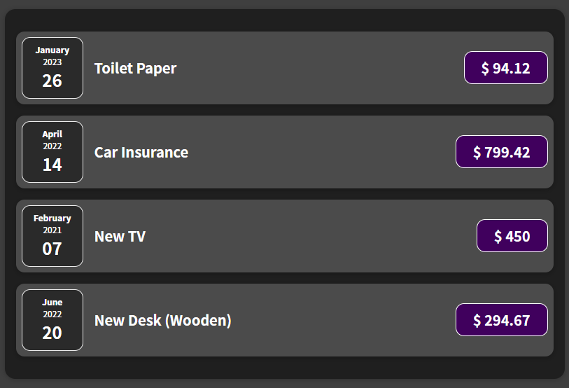
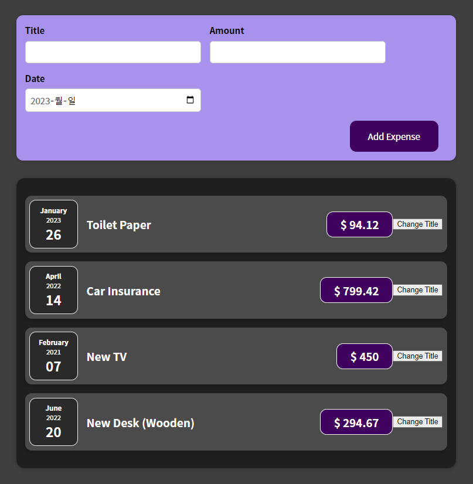
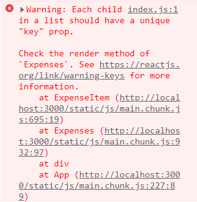
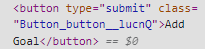

> 2022-12-26



<br>

# React 동작 원리
리액트의 주요 파일 : index.js, index.html, App.js

- index.js에서 root 요소를 생성하여 index.html에서 보여줄 페이지를 구성
- index.html : 리액트가 SPA 개발에 사용되는 이유는 index.html 문서 하나로 모든 웹 페이지를 표현할 수 있기 때문
- App.js : 모든 컴포넌트를 담는 그릇, 리액트의 컴포넌트 트리는 App 컴포넌트로부터 시작

<br>

# Props를 통한 컴포넌트 간 데이터 전달
- props는 properties를 의미하며 보통 props라는 이름으로 사용
- props는 상위 컴포넌트로부터 전달된 properties들을 담는 객체
- 하위 컴포넌트에서 속성값을 얻고자 할 때 "props.속성명"으로 사용

<br>

---

> 2022-12-28

<br>

# 컴포넌트
리액트는 다양한 컴포넌트(함수)가 반환하는 요소를 렌더링 하는 원리를 이용한 컴포넌트들의 결합을 통해 사용자 인터페이스를 구현하는 라이브러리이다.

컴포넌트들로 구성된 페이지를 크롬의 개발자 도구에서 확인하면 사용자 정의 컴포넌트의 모습은 확인할 수 없다. 그 이유는 결국 사용자 정의 컴포넌트도 기본 컴포넌트로 구성되기 때문이다.

<br>

---

> 2023-01-01



<br>

# 이벤트 리스너
리액트는 우리가 설정한 속성(onClick)에 설정한 값(clickHandler)을 렌더링된 요소에 리스너로 추가한다.

렌더링된 요소는 결국 자식 컴포넌트이며, 부모 컴포넌트(함수를 정의하고 컴포넌트를 사용한 코드를 가진 컴포넌트)로부터 props로 함수를 전달받아 실행할 수 있다. 
자식 컴포넌트는 함수 실행 결과를 부모 컴포넌트에게 전달할 수 있다.

```
function func_name(props) {

    const clickHandler = () => {
        console.log("Clicked!");
    }

    return (
        <button onClick={clickHandler}>
            Change Title
        </button>
    );
}
```
## 이벤트 리스너 추가 방법
1. 이벤트 리스너 함수를 작성한다.
2. 이벤트에 대한 props에서 함수를 호출하지 않고 함수 이름만 지정한다.

> 만약 함수를 호출(함수이름 + "`()`")한다면 jsx 코드가 컴파일 될 때(렌더링인가...) 함수가 실행되기 때문에 이벤트가 발생했을 때에는 반응이 없을 것이다. 

<br>

## 이벤트 리스너 함수명
> 이벤트 종류 + ... + Handler 

필수는 아니고 이렇게 하면 좋다~ (권장)

<br>

# State

## 리액트가 jsx를 브라우저에 보여주는 방법
1) 리액트는 함수형 프로그래밍 방식이다.
2) 함수는 jsx 코드를 반환한다.
3) 함수 호출 방법은 무엇이고, 누가 호출하지?

리액트는 jsx 코드를 보고 우리가 정의한 함수(컴포넌트 함수)를 호출한다. 가장 첫 컴포넌트는 index.js에 있다. 더이상 호출할 함수가 없을 때까지 계속해서 컴포넌트 함수를 호출한다. 이후 결과를 DOM 명령어로 변환하여 렌더링한다.

근데 리액트는 모든 DOM 요소를 렌더링한 후 작업을 멈추기 때문에 컴포넌트가 보여주는 내용을 변경하기 위해서는 state의 도입이 필요하다.
(리액트는 변수값이 바뀐다 해도 컴포넌트를 재렌더링 하지 않음)

<br>

## useState
특별한 변수를 생성하는 함수이다.
이 변수는 변경되면 컴포넌트 함수를 재실행하게 만든다.
초기값을 설정할 수 있으며, useState가 반환하는 값을 통해 변수에 접근 가능하다.
- useState 반환값 : 배열 ``[초기값, 업데이트 함수]``
  - 초기값 : 말 그대로 제일 처음 저장되는 초기 상태값이다.
  - 업데이트 함수 : 상태를 변경하기 위해 사용하는 함수이다.

<br>


### 왜 state를 직접 변경하지 않고 업데이트 함수를 사용해야 하나요?
state는 리액트가 관리하는 변수 저장 공간이라 할 수 있다.
리액트는 이 state에 저장된 값이 변하면 해당 state가 존재하는 컴포넌트를 리렌더링한다.

state를 업데이트하는 함수를 호출하여 값을 변경할 수 있는데 변경된 값이 바로 반영되지 않는다. state 변경이 많으면 그만큼 리렌더링 횟수가 많아지기 때문에 성능이 저하된다. 그래서 리액트는 16ms 동안 변경되는 state 값을 저장했다가 한번에 리렌더링하는 batch update(일괄 리렌더링)를 한다.

<br>

## 독립적인 state 선언
```
const [enteredTitle, setEnteredTitle] = useState("");
const [enteredAmount, setEnteredAmount] = useState();
const [enteredDate, setEnteredDate] = useState("");

setEnteredTitle("Hello");
...
```
<br>

## state 그룹
```
const [userInput, setUserInput] = useState({
    enteredTitle: '',
    enteredAmount: '',
    enteredDate: ''
});

setUserInput({
    ...userInput,
    enteredTitle: e.target.value
});
...
```
하나의 상태 업데이트 함수에 의존하여 상태를 변경하기 때문에 이전 상태의 스냅샷에 의존하게 된다.

<br>

```
setUserInput((prevState) => {
    return { ...prevState, enteredTitle: event.target.value };
});
```
위의 방법을 사용하면 항상 최신의 이전 상태 스냅샷을 보장한다.
상태 업데이트에 의한 리렌더링 즉, 이전 상태에 의존하고 있는 컴포넌트의 경우 위의 방법을 사용해야 한다.

<br>

---

> 2023-01-01

<br>

# 데이터 전달

하향식 데이터 전달 : 부모 컴포넌트 → 자식 컴포넌트 = `props`
상향식 데이터 전달 : 자식 컴포넌트 → 부모 컴포넌트 = 함수 값 반환

부모 컴포넌트를 통해 연결된 형제 컴포넌트 간 직접적인 데이터 전달은 불가능 ▶ 가장 가까운 부모 컴포넌트를 통해 데이터 전달

<br>

## 리액트에서 이벤트리스너가 동작하지 않는 이유
addEventListener를 통한 이벤트 수신 코드는 명령형 코드이기에 해당 코드로는 React 기능을 사용하지 않으며 React 컴포넌트 외부에 있는 일부 함수를 트리거하므로 React 컴포넌트 상태와 상호 작용할 수 없습니다.

## Stateful Component vs Stateless Component

<br>

# 렌더링 리스트 및 조건부 Content

## 목록을 동적으로 렌더링 하는 방법
`map()` : JS 내장 함수. 원본 배열의 모든 요소에 대해 연산, 변환하여 새로운 배열로 반환하는 함수이다.

```
...
   {props.items.map(expense => {
        return 
            <ExpenseItem 
                title={expense.title} 
                amount={expense.amount} 
                date={expense.date} 
            />
        })
   }
```

## keys


리액트는 `keys`를 통해 list를 통한 컴포넌트 인스턴스를 렌더링할 때 발생할 수 있는 성능 저하나 버그 없이 목록 업데이트와 렌더링 할 수 있다.

리액트는 새로운 list 아이템을 동적으로 추가하면 부모 컴포넌트의 마지막 자식 컴포넌트로 렌더링하고, 모든 list 아이템을 업데이트하여 DOM 요소를 교체한다. 
다시 말하자면 리액트는 list 내의 아이템을 식별할 수 없기 때문에 추가된 아이템이 어디에 렌더링되어야 하는지 알지 못한다.
따라서 새로운 아이템이 어디에 추가되어야 하는지 리액트에게 알려주어야 하는데 그 방법이 바로 `key props`이다.

<br>

---
> 2023-01-03

<br>

## 조건에 따라 출력하기

### 삼항 연산자
```        
{filteredExpenses.length === 0 ? (
    <p>No expenses found.</p>
    ) : (
    filteredExpenses.map(expense => 
        <ExpenseItem 
            key={expense.id}
            title={expense.title} 
            amount={expense.amount} 
            date={expense.date} 
        />
    ))
}
```
<br>

### && 연산자
```
{filteredExpenses.length === 0 && <p>No expenses found.</p>}
{filteredExpenses.length === 0 && 
    filteredExpenses.map(expense => 
        <ExpenseItem 
            key={expense.id}
            title={expense.title} 
            amount={expense.amount} 
            date={expense.date} 
        />
    )
}
```

<br>

### js 코드
```
let expensesContent = <p>No expenses found.</p>;
if (filteredExpenses.length> 0) {
    expensesContent = filteredExpenses.map(expense => 
        <ExpenseItem 
            key={expense.id}
            title={expense.title} 
            amount={expense.amount} 
            date={expense.date} 
        />
    );
}

return (
    {expensesContent}
);
```
<br><br>

> 2023-01-04

<br>

# 컴포넌트 스타일
- Conditional & Dynamic Styles
- Styled Components
- CSS Modules

<br>

## Conditional & Dynamic Styles
### 동적 인라인 스타일 설정
```
<label style={{color: isValid ? 'black' : 'red'}}>Label</label>
```
상태 변화를 통해 스타일이 동적으로 변경됨

<br>

### 동적 css 클래스 설정
```
<!-- JSX 코드 -->
<div className={`form-control ${isValid ? "" : "invalid"}`}>
  <label>Label</label>
  <input 
    type="text" 
  />
</div>

<!-- CSS 코드 -->
.form-control.invalid input {
  border-color: red;
  background-color: #ffd7d7;
}

.form-control.invalid label {
  color: red;
}
```

CSS 파일에 스타일이 지정된 선택자 (클래스, ID 등)의 중복으로 인해 의도하지 않은 스타일이 반영될 가능성이 있다.

이를 위해 styled component를 사용한다.

<br><br>

> 2023-01-06

<br>

## Styled Components
특정한 스타일이 첨부된 컴포넌트를 구축할 수 있도록 해주는 패키지
스타일이 첨부되는 컴포넌트에만 영향을 미치고 다른 컴포넌트에는 영향을 주지 않는다.

- 패키지 설치
```
npm install --save styled-components
```
<br>

### 사용 방법
- tagged template literal : 자바스크립트 기능

▶ button은 styled의 메소드 일종으로 괄호 대신 백틱을 사용

- button 메소드는 새로운 button 컴포넌트를 반환 (styled는 html 요소에 대한 메소드를 내장하고 있음)

<br>

- ```.button:focus``` 가상 선택자의 경우에는 `&` 기호를 사용하여 표현

- styled의 메소드를 통해 반환된 새 컴포넌트는 styled가 할당한 고유 클래스 명을 가지기 때문에 다른 컴포넌트에 영향을 주지 않는다!

- styled가 반환한 컴포넌트 역시 props를 전달하고, 전달받을 수 있기 때문에 유효성 검사를 통해 클래스를 추가하거나 삭제할 수 있다.

- styled 메소드 내에서 props를 사용할 수 있기 때문에 동적인 스타일링이 쉽게 가능하다.
```
<!-- JSX -->
<FormControl invalid={!isValid}>
...
</FormControl>


<!-- styled method -->
  border: 1px solid  ${props => props.invalid ? 'red' : '#ccc'};
  background-color: ${props => props.invalid ? '#ffd7d7' : 'transparent'};
```

<br><br>

> 2023-01-07

<br>

## CSS Moudules

>CSS 모듈은 그 기능을 지원하도록 설정된 프로젝트에서만 사용 가능 
<br>
▶ 브라우저에서 코드가 실행되기 전에 코드 변환이 필요하기 때문 (리액트 프로젝트에서 사용 가능)

<br>

CSS 모듈이 하는 일 또는 개념 또는 내부에서 수행하는 구축 프로세스는 CSS 파일이나 클래스를 가지고 그 클래스 이름을 고유하게 바꾸는 작업을 한다.

<br>

CSS 모듈의 개념은 CSS 파일에서 설정한 CSS 스타일의 범위는 해당 CSS 파일을 import한 파일 내에 있는 컴포넌트에만 적용된다는 것이다. (styles 객체를 통해 클래스에 접근하기 때문에 같은 파일의 컴포넌트에만 제한되는 것!)

<br>

### 사용 방법
```
import styles from './Button.module.css';
```
CSS 모듈을 사용하기 위해서는 css 파일을 통해 import 해야 한다.
CSS 모듈을 변환하기 위해서는 특수한 css 파일명을 사용한다.
- CSS 모듈 작동을 위해 컴파일 프로세스에게 요청

css 파일을 통해 import 한 styles 객체를 통해 css 파일에서 사용한 모든 클래스를 동적으로 사용할 수 있다.

CSS 모듈을 통해 스타일이 적용된 요소에는 styled-component와는 또다른 클래스가 추가된 것을 확인할 수 있다.



``컴포넌트 이름_클래스 이름__고유한 해시값``

<br><br>