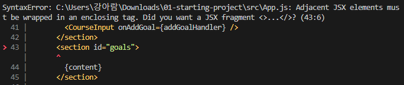
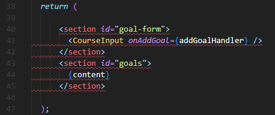
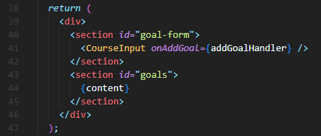
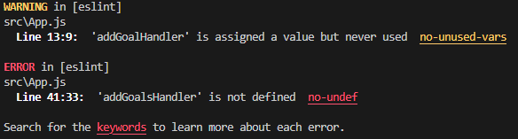
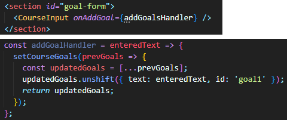
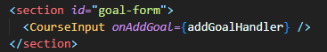
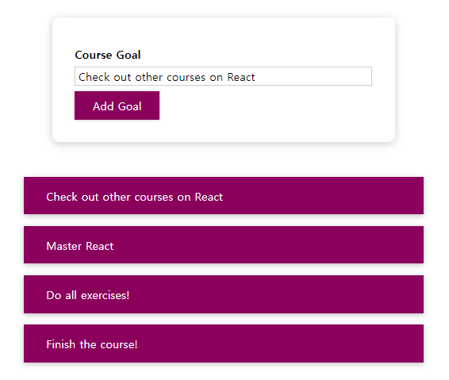
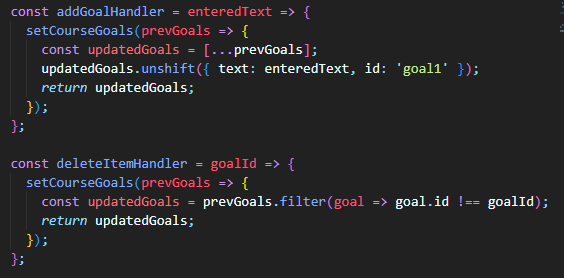
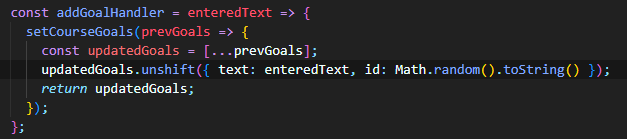

> 2023-01-07

 

# Debugging React App
> 에러를 해결하는 것도 개발이다!

## Error 1

- 에러가 발생한 위치 : App.js 43번째 줄
- 에러가 발생한 원인 : JSX 함수는 하나의 루트 요소만 포함하는 컴포넌트를 반환하기 때문에 여러 개의 컴포넌트를 하나의 루트 컴포넌트로 감싸야 한다!

 

### 에러 코드

 

### 해결

 

## Error 2

- 에러가 발생한 이유 : addGoalsHandler 가 정의되어 있지 않아서 발생한 에러 ▶ 단순 오타로 인한 컴파일 에러!

 

### 에러 코드

 

### 해결

 

## Error 3

- 에러 : 삭제하려는 List item을 누르면 이전 item이 삭제됨
- 에러가 발생한 이유 : List item을 삭제하기 위해 item의 ID 값을 얻어야 한다. 
 그러나 ID 할당 과정에서 random() 함수를 이용한 ID가 아닌 'goal1'이라는 고정 ID가 할당되기 때문에 goal1이라는 ID를 가진 첫 번째 item이 삭제된다!

 

### 에러 코드

 

### 해결

  

# 에러 해결 방법
- Terminal에 출력되는 에러 확인
- 브라우저 창에 출력되는 에러 확인
- F12(개발자 도구)의 콘솔 탭에 출력되는 에러 또는 경고 확인
- F12의 소스 탭에서 디버깅을 통해 해결

- ``react devtools`` : 리액트 프로그래밍에 특화된 개발자 도구