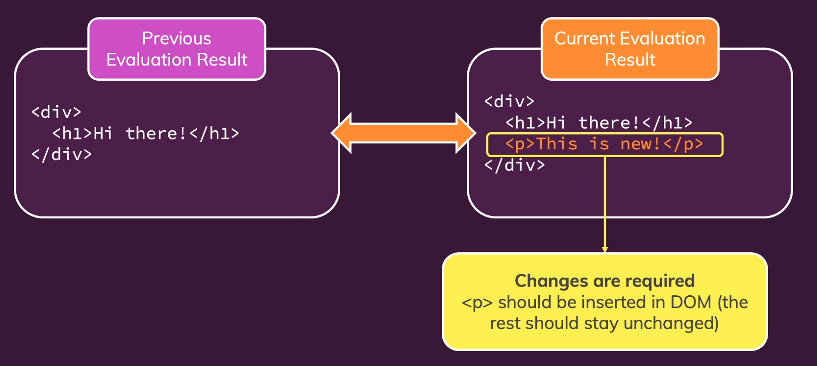

> 2023-01-24

# React

1. React 원리
2. Virtual DOM & DOM Update
3. State
   <br><br>

# 1. React 원리

React : 사용자 인터페이스를 구축하기 위한 자바스크립트 라이브러리

<br>

## React와 ReactDOM

리액트는 컴포넌트 개념을 채택하여 사용자 인터페이스를 구축한다.

웹에 DOM 요소를 렌더링하기 위해 'react-dom'을 함께 사용해야 한다.

리액트는 컴포넌트, 상태를 관리하는 라이브러리이고, 변경된 내용과 정보를 리액트 DOM으로 전달한다.

리액트 DOM은 컴포넌트를 실제 DOM 요소로 변환하여 화면에 렌더링한다.

<br><br>

## Props와 State

리액트는 props와 state를 다룬다.

props는 데이터를 하위 컴포넌트로 전달하기 위해 필요한 속성이다.
부모와 자식 간 데이터 통신을 위해 props를 사용한다.

또한 컴포넌트 내의 데이터인 state와 컴포넌트 전체의 데이터인 context를 다룬다.

<br>

props, state, context가 변경되면 리액트는 컴포넌트의 정보를 변경시키고, 변경된 데이터들이 화면 출력을 변경시키는지 확인한다.

만약 데이터들로 인해 화면에 출력할 내용이 변경되면 리액트 DOM에게 알려 리액트 DOM이 새로운 화면을 렌더링하도록 한다.

<br><br>

# 2-1. Virtual DOM

가상 DOM은 웹 화면에 최종적으로 출력될 컴포넌트 트리를 결정하는데 사용된다. 상태에 따라 컴포넌트 트리의 현재 모양과 변경된 모양을 결정하고, 상태가 변경되면 컴포넌트 트리 정보를 리액트 DOM에게 전달한다. 리액트 DOM은 이전 상태와 최종 상태를 비교하여 달라진 부분의 내용을 리렌더링한다.

<br><br>

# 2-2. DOM Update

props, state, context 등의 변경으로 컴포넌트가 변경되면 컴포넌트 함수가 재실행되는데 무조건 리렌더링 되지는 않는다.
리액트 DOM은 리액트가 구성한 컴포넌트의 이전 상태와 현재 상태 간의 차이를 비교하여 필요한 경우에만 다시 렌더링한다.



<br>

```
import React, { useState } from "react";
import Button from "./components/UI/Button/Button";
import "./App.css";

function App() {
  const [showParagraph, setShowParagraph] = useState();

  const toggleParagraphHandler = () => {
    setShowParagraph(prevShowParagraph => !prevShowParagraph);
  };

  console.log("APP RUNNING");
  return (
    <div className="app">
      <h1>Hi there!</h1>
      {showParagraph && <p>This is new!</p>}
      <Button onClick={toggleParagraphHandler}>Show Paragraph!</Button>
    </div>
  );
}

export default App;
```

<br>

위 예제에서는 toggle 버튼으로 문장을 보이게 하거나 사라지게 한다.
컴포넌트 함수가 실행될 때마다 "APP RUNNING"이라는 문구가 콘솔창에 출력될 것이다.

<br><br>

## 브라우저 콘솔로 확인하기

- 첫 화면이 렌더링되면 컴포넌트 함수가 실행되며 문구가 출력됨
  

<br>

- 버튼을 클릭하면 컴포넌트 함수가 재실행되며 문구가 한 번 더 출력됨
  

<br><br>

## 브라우저 개발자 도구로 확인하기

- 버튼을 클릭하면 <p> 요소만 변경됨을 확인할 수 있음
  

- 다시 버튼을 클릭하면 <p> 요소가 사라지고 App 컴포넌트의 수정을 알 수 있음 (다른 요소의 변경은 없음)
  

<br><br>

## React.memo()

리액트는 컴포넌트의 컨텍스트 변화를 감지해 리렌더링 여부를 결정하지만 결국 리렌더링 되지 않는 컴포넌트의 함수도 재실행된다. (함수를 재실행한 결과가 이전 결과와 다를 때에만 리렌더링 할 뿐이다!)

그래서 최적화를 위해 `React.memo()`를 사용한다.

```
const Button = props => {
  console.log("Button RUNNING", props.children);

  return (
    <button
      type={props.type || "button"}
      className={`${classes.button} ${props.className}`}
      onClick={props.onClick}
      disabled={props.disabled}>
      {props.children}
    </button>
  );
};

export default React.memo(Button);
```

<br>

### 원리

`React.memo()`는 컴포넌트가 가지고 있는 상태값을 메모리에 저장해두고, 상위 컴포넌트(또는 컴포넌트의 상태에 영향을 주는 컴포넌트)가 변경될 때 memo로 감싸진 컴포넌트의 이전 상태와 현재 상태를 비교하여 상태가 변경되었을 때에만 함수를 재실행한다.

<br>

### 특징

`React.memo()`를 사용하면 함수의 재실행을 방지하는 효과를 얻을 수 있다. 그러나 상태가 계속해서 변하는 컴포넌트의 경우 memo를 사용해도 소용이 없다.

또한 React.memo()로 인해 메모리를 사용해야 하고, memo 함수를 실행하여 상태값이 변경되었는지 확인해야 하기 때문에 함수를 재실행할 때와 비교하여 더 효율적인 방법을 선택해야 한다.

<br>

### 한계

`React.memo()`를 사용해도 컴포넌트가 재실행될 수 있다.

```
function App() {
  const [showParagraph, setShowParagraph] = useState(false);
  const [allowToggle, setAllowToggle] = useState(false);

  const toggleParagraphHandler = () => {
    setShowParagraph(prevShowParagraph => !prevShowParagraph);
  });


  console.log("APP RUNNING");
  return (
    <div className="app">
      <h1>Hi there!</h1>
      <DemoOutput show={showParagraph} />
      <Button onClick={toggleParagraphHandler}>Show Paragraph!</Button>
    </div>
  );
}

export default App;
```

위 경우에는 `toogleParagraph`가 `Show Paragraph!` 버튼의 props로 전달된다.
이때 App 컴포넌트의 상태가 변경될 때마다 "Button RUNNING" 메시지가 출력된다.

<br><br>

## 왜 `React.memo`를 사용해도 Button의 컴포넌트 함수가 재실행될까?

JS의 원시값과 객체의 차이, '`===` 연산자'를 생각하면 된다.

<br>
1) `React.memo` 함수가 실행되면 이전 상태값과 현재 상태값을 `===` 연산자로 비교한다.

2. JS의 자료형 중 기본형은 원시값은 값 자체가 변수에 할당되지만, 참조형은 값이 저장된 주소값을 참조하는 형식으로 변수에 주소값을 할당한다.

<br>

`Show Paragraph` 버튼에 onClick 함수가 props로 전달되고 있다.

App 컴포넌트 함수가 재실행되면 원시값은 불변이므로 상태가 변하지 않지만 함수는 객체이기 때문에 새로 생성되어 버튼으로 전달된다.

이런 이유로 버튼 함수가 재실행되어 결국 `memo`가 소용없어진다.

<br><br>

## useCallback()

함수 등의 객체가 재생성되어 `React.memo()`가 소용 없어지는 것을 방지하기 위해 `useCallback()` 함수를 사용한다.

```
const toggleParagraphHandler = useCallback(() => {
    setShowParagraph(prevShowParagraph => !prevShowParagraph);
  }, []);
```

`useCallback()`을 사용하면 React가 사용하는 메모리 저장소에 해당 함수가 저장된다.
그래서 `React.memo()` 로 최적화가 가능해진다.

<br>

### 문제점

만약 useCallback 안의 함수가 다른 상태값에 의존하여 실행할 수 있게 된다면 함수 실행이 불가능해진다.

```
function App() {
  const [showParagraph, setShowParagraph] = useState(false);
  const [allowToggle, setAllowToggle] = useState(false);

  const toggleParagraphHandler = useCallback(() => {
    if (allowToggle) setShowParagraph(prevShowParagraph => !prevShowParagraph);
  }, []);

  const allowToggleHandler = () => {
    setAllowToggle(prevAllowToggle => !prevAllowToggle);
  };

  console.log("APP RUNNING");
  return (
    <div className="app">
      <h1>Hi there!</h1>
      <DemoOutput show={showParagraph} />
      <Button onClick={allowToggleHandler}>Allow Toggle!</Button>
      <Button onClick={toggleParagraphHandler}>Show Paragraph!</Button>
    </div>
  );
}

export default App;
```

위 경우에는 `allowToggle` 의 상태가 다른 버튼을 통해 변경되고, 상태값이 true가 되어야 함수가 실행된다.

초기값이 `false`인데, `Allow Toggle` 버튼을 클릭하면 `Show Paragraph` 버튼으로 문장을 출력할 수 있을까?

<br>

> 불가능하다.

<br>

`useCallback` 내의 함수는 App 컴포넌트 함수가 처음 실행될 때의 상태 그대로 React 저장소에 저장된다. 따라서 `false`로 지정된 `allowToggle`의 상태가 변경되어도 함수는 `false` 값을 가진 채로 실행되기 때문에 문장이 출력되지 않는다.

이 문제를 해결하기 위해 `useCallback`은 의존성 배열을 사용한다.

외부의 상태값에 의존하는 함수의 경우, 의존성 배열에 상태값을 넣어 외부에서 상태가 변화할 때마다 함수가 변경된 상태값을 사용할 수 있도록 한다.

<br><br>

# 3. State
